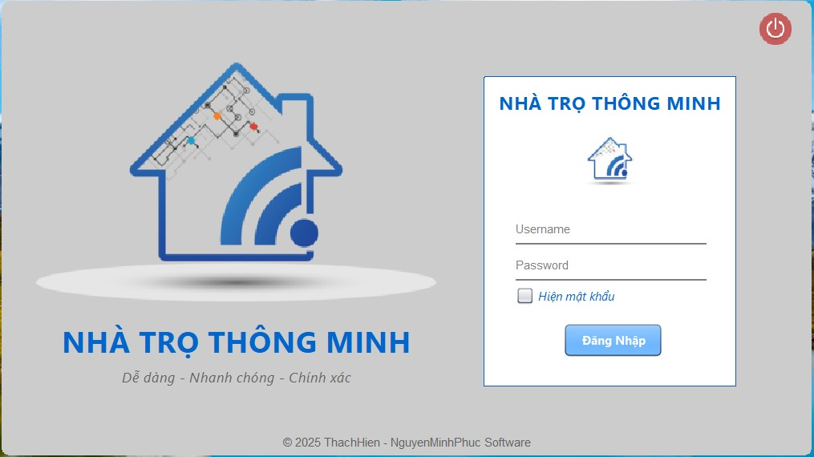
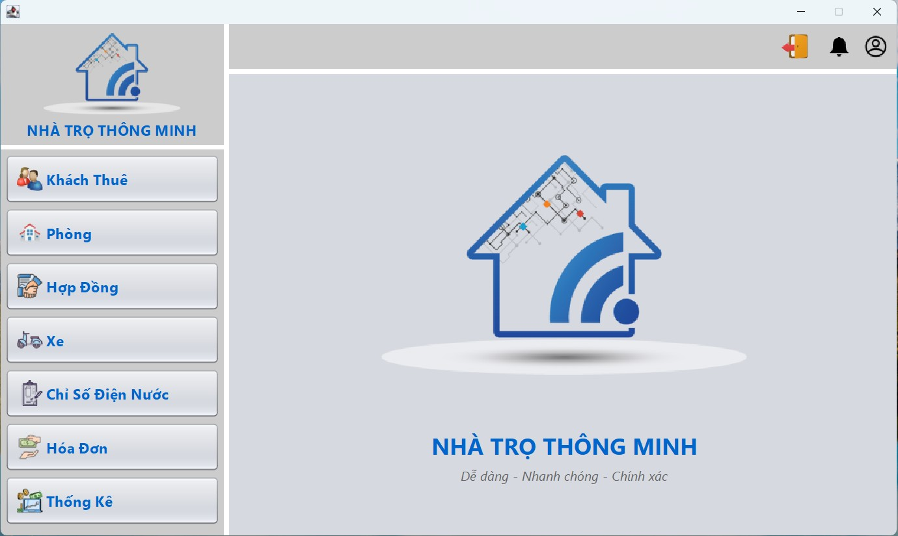
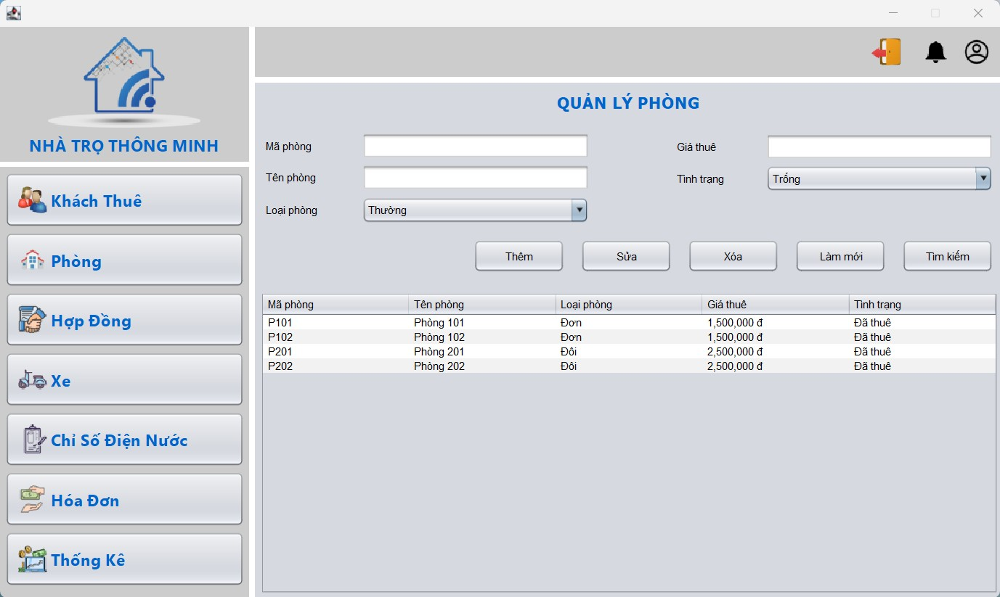
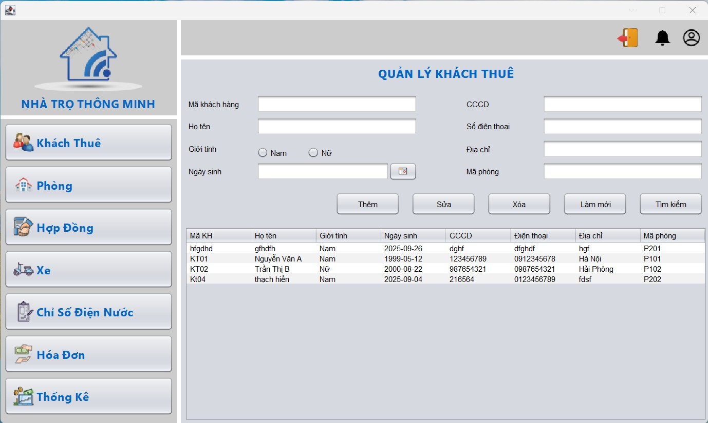
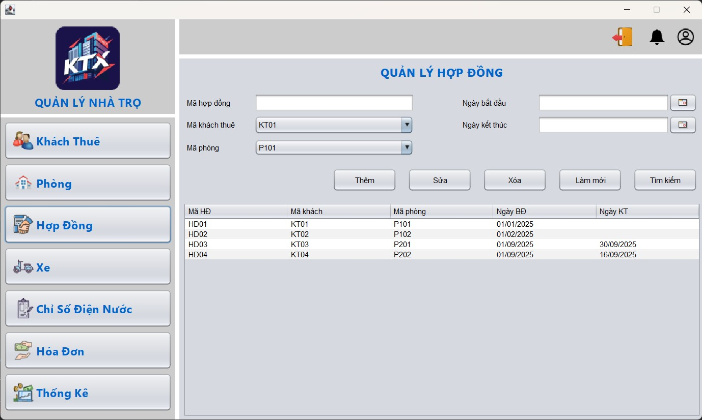
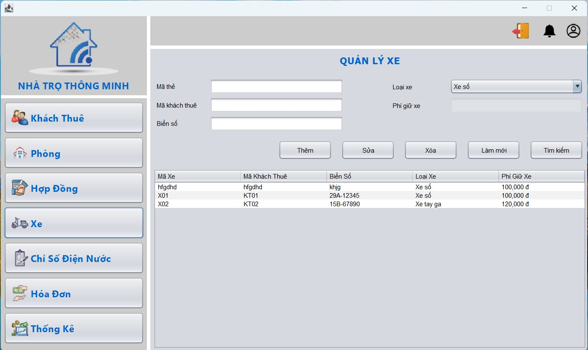
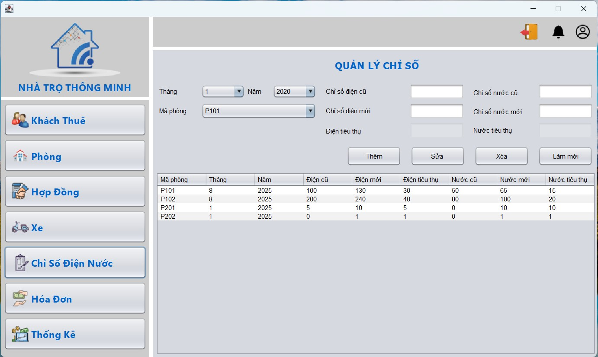
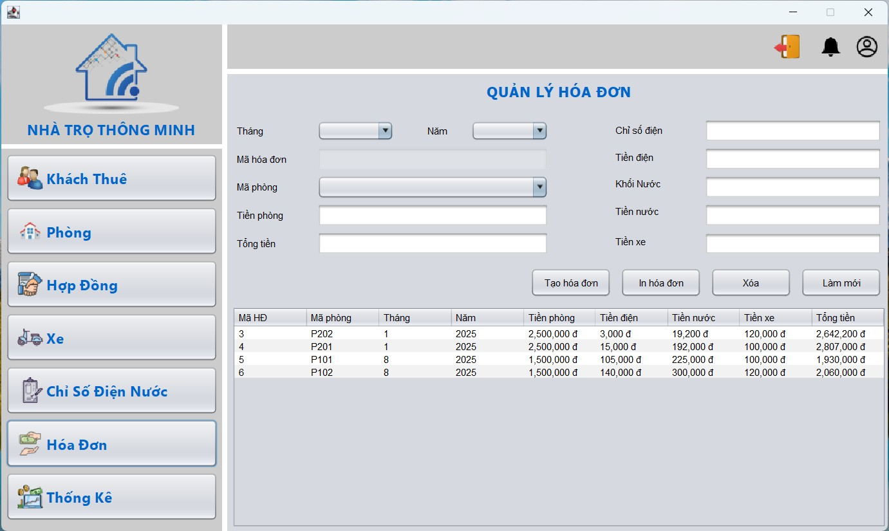
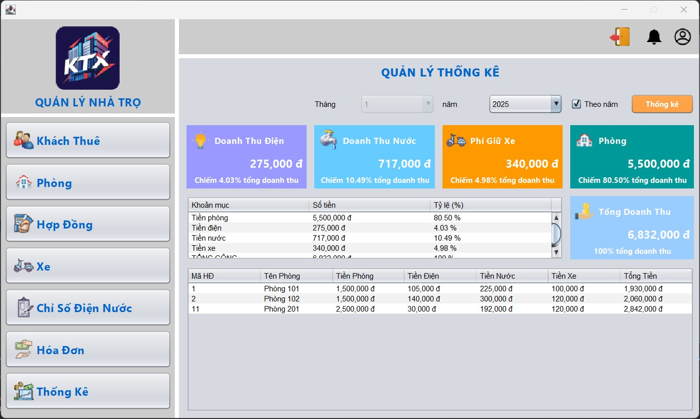

# 🏠 Phần mềm Quản Lý Nhà Trọ (Java Swing + SQL Server)

Dự án xây dựng hệ thống quản lý nhà trọ cơ bản gồm các chức năng:
- Đăng nhập
- Quản lý Phòng
- Quản lý Khách Thuê
- Quản lý Hợp Đồng
- Quản lý Xe
- Quản lý Chỉ số điện nước
- Quản lý Hóa đơn
- Thống kê doanh thu

---

## 🚀 Giao diện chính

### 🔑 Login


### 🏠 Trang chủ


### 🏢 Quản lý Phòng


### 👤 Quản lý Khách Thuê


### 📑 Quản lý Hợp Đồng


### 🚲 Quản lý Xe


### ⚡ Quản lý Chỉ số điện nước


### 💵 Quản lý Hóa Đơn


### 📊 Thống kê


---

## ⚙️ Công nghệ sử dụng
- **Java Swing**: Xây dựng giao diện
- **SQL Server**: Lưu trữ dữ liệu
- **Maven**: Quản lý thư viện

---

## 📌 Hướng dẫn cài đặt
1. Clone repo về máy:
   ```bash
   https://github.com/thachhien-github/QL_NhaTro.git
   ```
2. Mở dự án bằng **NetBeans**.
3. Import database `QuanLyNhaTro.sql` trong thư mục `/database`.
4. Chỉnh sửa file `DBConnection.java` cho phù hợp với cấu hình SQL Server trên máy.
5. Chạy chương trình từ `LoginFrame.java`.
- Username: admin.
- Password: admin.

---

## ✨ Tính năng nổi bật
- CRUD đầy đủ cho **Phòng, Khách Thuê, Hợp Đồng, Xe, Hóa Đơn, Chỉ số**.
- Dữ liệu được xử lý qua **Stored Procedure + Trigger** → đảm bảo đồng bộ.
- Giao diện hiện đại, dễ sử dụng.
- Tích hợp chức năng **refresh tự động** khi chuyển panel.

---
